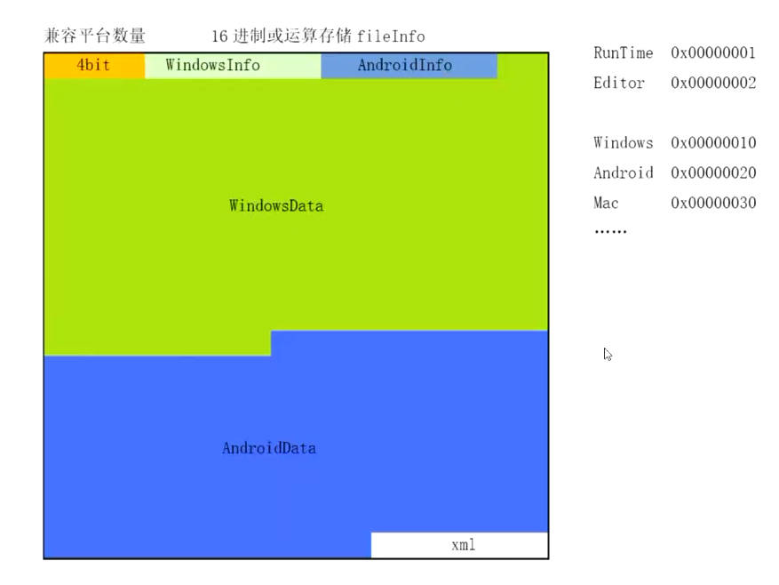
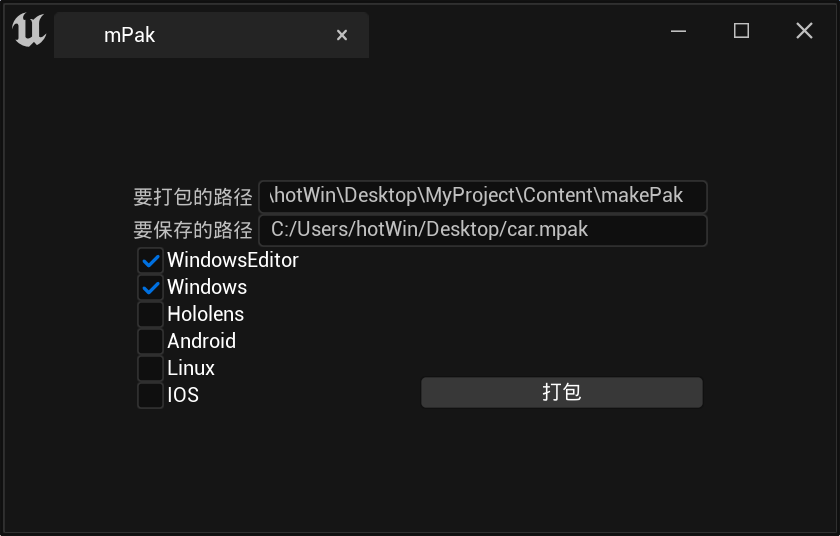
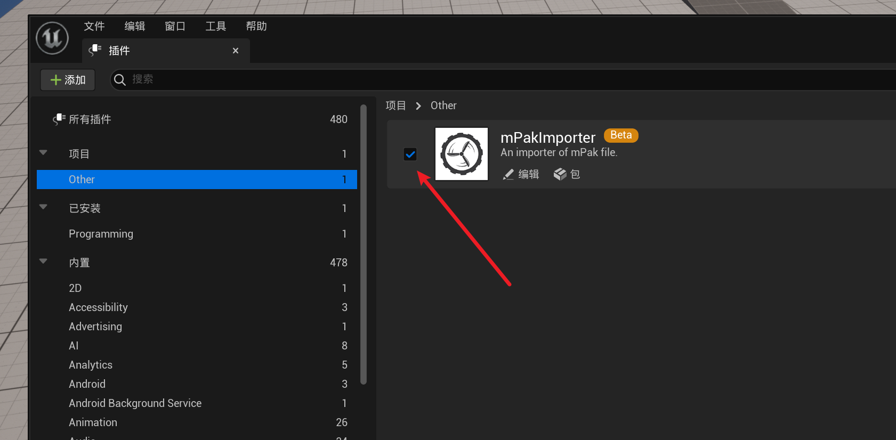

</img>

<h1 align="center" style="font-size:50px;font-weight:bold">mPak</h1>

多平台pak集成解决方案

    
     
    

[English](./README_en.md)

# 关于标志:
这个标志是轮胎和螺旋桨的组合。轮胎和螺旋桨都能从引擎中接受动力并推动机器向前移动。因此，这个组件既可以用于陆地交通，也可以作为游艇的推进系统。同样适用于mPak文件，它可以被开发者用于项目测试，并且在发布的项目中也可以进行热更新。

# 关于项目:
该项目提供了打包、解析和挂载mPak文件的方法，将不同平台的软件包和未编译的资源集成到mPak文件中，使它们具有跨平台兼容性。它支持不同阶段的挂载，例如在编辑阶段进行开发和在项目打包后进行发布。

# 文件结构:
</img>

# 制作mpak文件:
 </img>

# 蓝图用法:
- [mPakPackage] 制作一个mPak文件
- [mPakUnpackage]  解析一个mpak文件
- [Mount_mPak] 将mpak文件挂载到项目上
- [GetmPakFileInfo] 获取mpak文件信息

# mPak导入的方法:
</img>
</img>

- Download and enable the mPakImporter

# 设计初衷：
- 降低资源包管理成本
- 使虚幻引擎项目更加灵活自由
- 打破开发者和用户之间的界限
- 降低功能测试的复杂性

