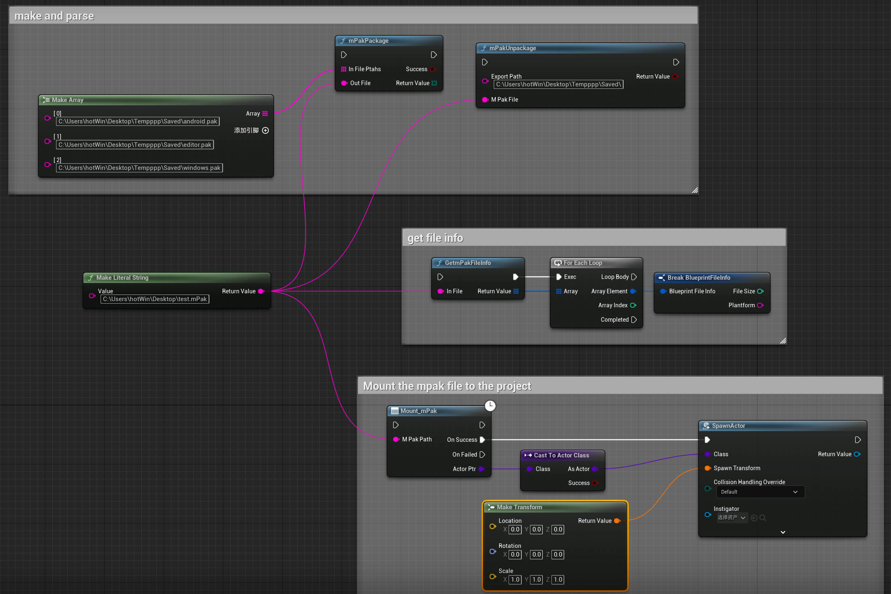

</img>

<h1 align="center" style="font-size:50px;font-weight:bold">mPak</h1>

Multi-platform pak integrated solution

    
     
    

# about:

This project provides pak packages and mounting methods, and integrates paks of different platforms and uncooked assets into mpak files, so that the files can be used across platforms and support mounting at different stages, such as development in the editor Stages and release stages after project packaging

# file structure:
</img>

# mPakCore Usage:
- [Pack]	mPakCore a.pak b.pak c.pak -o=outfile.mpak
- [unPakc]  mPakCore outfile.mpak -o=C:\Users\admin\Desktop\		 

# Make mPak file:
 </img>

# mPak importer Usage:
</img>
</img>

- Download and enable the mPakImporter

# original intention of design：
- Reduce the cost of managing resource bundles
- Making Unreal Engine project more flexible and free
- Breaking down the boundaries between developer and user
- Reduce the complexity of functional testing
