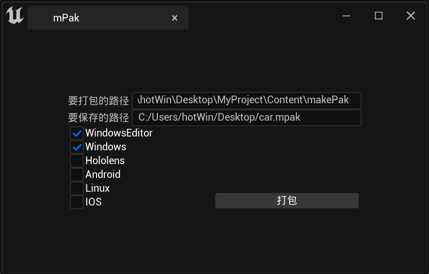

</img>

<h1 align="center" style="font-size:50px;font-weight:bold">mPak</h1>

Multi-platform pak integrated solution

    
     
    

# about logo:
About the logo, it is a combination of a tire and a propeller. The functions of both the tire and the propeller are to receive power from the engine and propel the machine forward. Therefore, this component can be used for both land transportation and as a propulsion system for yachts. The same applies to the mPak file, which can be used by developers, for project testing, and can also be hot-updated in released projects.
# about project:
This project provides methods for packaging, parsing, and mounting mPak files, integrating packages and uncoked assets from different platforms into mPak files, making them cross-platform compatible. It supports mounting at different stages, such as development during the editing phase and release after project packaging.

# file structure:
</img>

# Make mPak file:
 </img>

# Blueprint Usage:
- [mPakPackage]	Make a mPak file
- [mPakUnpackage]  Parse a mpak file
- [Mount_mPak]  Mount the mpak file to the project
- [GetmPakFileInfo] Get the mpak file info

# mPak importer Usage:
</img>
</img>

- Download and enable the mPakImporter

# original intention of design：
- Reduce the cost of managing resource bundles
- Making Unreal Engine project more flexible and free
- Breaking down the boundaries between developer and user
- Reduce the complexity of functional testing

